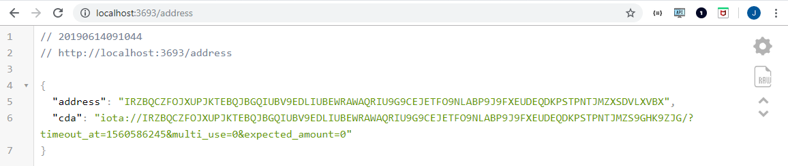

# If Tangle Then That

This small Go application creates a client library [account](https://docs.iota.org/docs/iota-go/0.1/how-to-guides/create-account) with your seed and exposes an API that allows you to generate conditional deposit addresses (CDA) and magnet links.

You can also create a callback to monitor those CDAs for changes such as incoming transactions. This allows you to easily trigger real-world actions based on Tangle messages.

## Prerequisites

To use this demo, you need the following:

* [Go](https://golang.org/doc/install)

* [Git](https://git-scm.com/download/linux)

## 1. Configure the application

Before you run the app, you need to configure it with the following settings:

- `IFTTT_SEED`: The account seed, required to run this program.
- `IFTTT_NODE_URI`: The node to connect to, for example `https://nodes.devnet.thetangle.org:443`

To configure these settings, you can either put them in a `.env` file or set them as environment variables on your system.

As well as these settings, you can also configure the following optional ones:

- `IFTTT_HOST`: The hostname to listen on, defaults to `localhost`
- `IFTTT_PORT`: The port to listen on, defaults to `3693`
 
 ## 2. Customize the callback
 
If a transaction is sent to one of your CDAs, this action will trigger a callback. By default, the callback prints the value of the transaction's `signatureMessageFragment` field to the console.

To customize this callback, edit the following function in the `ifttt.go` file:
 
```go
lis := listener.NewCallbackEventListener(em)
	lis.RegReceivedDeposits(func(bun bundle.Bundle) {
		fmt.Println("Receiving Deposit!")
		for _, tx := range bun {
			msg, err := converter.TrytesToASCII(removeSuffixNine(tx.SignatureMessageFragment))
			if err == nil {
    				// Customize the callback here
				fmt.Println("Message: ", msg)
			}
		}
	})
```

## 3. Run the application

1. Clone this repository

	```bash
	git clone https://github.com/iota-community/ifttt.git
	```

2. Change into the `ifttt` directory

	```bash
	cd ifttt
	```
 
3. Run the code

	```bash
	go run ifttt.go
	```
	
	The server is now listening on `IFTTT_HOST`:`IFTTT_PORT`.
	
4. To get a new CDA and a magnet link, send a `GET` request to the `address` endpoint. For example, you can open a browser, and enter `localhost:3693/address`

	
	
	**Note:** The output may look different in your browser. This example uses the [JSON viewer Chrome extension](https://chrome.google.com/webstore/detail/json-viewer/gbmdgpbipfallnflgajpaliibnhdgobh) to make the output easier to read.


